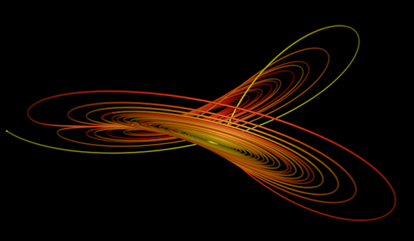

# Mecánica Clásica - Segundo semestre de 2014 - UIS

**Asignatura de posgrado de la Maestría en Física de la [Universidad Industrial de Santander](http://www.uis.edu.co/ "UIS")**

Las clases fueron realizados en [Samsung Notes](https://www.samsung.com/us/support/owners/app/samsung-notes). Para facilitar la difusión, se incluyen también versiones de las clases en formato pdf. Para visualizarlo, podría necesitar descargar [Acrobat Reader](https://get.adobe.com/es/reader).

## Información importante

Este commit correponde a la última edición del curso, correspondiente a la Cohorte 2014. Con este commit y release se da por cerrado el repositorio.

Todo este material ha sido liberado utilizando una licencia de dominio público creative commons [CC0-1.0-Universal](https://creativecommons.org/publicdomain/zero/1.0/). Por favor revise los [términos de la licencia](#licencia) antes de su uso.

## Contenido

* Unidad 1: [Caos](clases/u01)
* Unidad 2: [Fuerzas Centrales](clases/u02)
* Unidad 3: [Formulación Hamiltoniana](clases/u03)
* Unidad 4: [Hamilton-Jacobi](clases/u04)

se incluyen [códigos y datos](codigos-y-datos-profesor) para los ejercicios prácticos.

## Bibliografía recomendada

[Classical Mechanics](https://www.pearson.com/en-us/subject-catalog/p/classical-mechanics/P200000006871/9780201657029) 3rd. Edition, Herbert Goldstein, Charles P. Poole, John L. Safko, Pearson (2002). ISBN: [978-0201657029](https://www.pearson.com/en-us/subject-catalog/p/classical-mechanics/P200000006871/9780201657029)

## Licencia 

<a property="dct:title" rel="cc:attributionURL" href="https://github.com/asoreyh/mecanica-clasica">Mecánica Clásica (UIS)</a> by <a rel="cc:attributionURL dct:creator" property="cc:attributionName" href="https://github.com/asoreyh/">Hernán Asorey</a> is marked with <a href="https://creativecommons.org/publicdomain/zero/1.0/?ref=chooser-v1" target="_blank" rel="license noopener noreferrer" style="display:inline-block;">CC0 1.0 Universal</a>.
